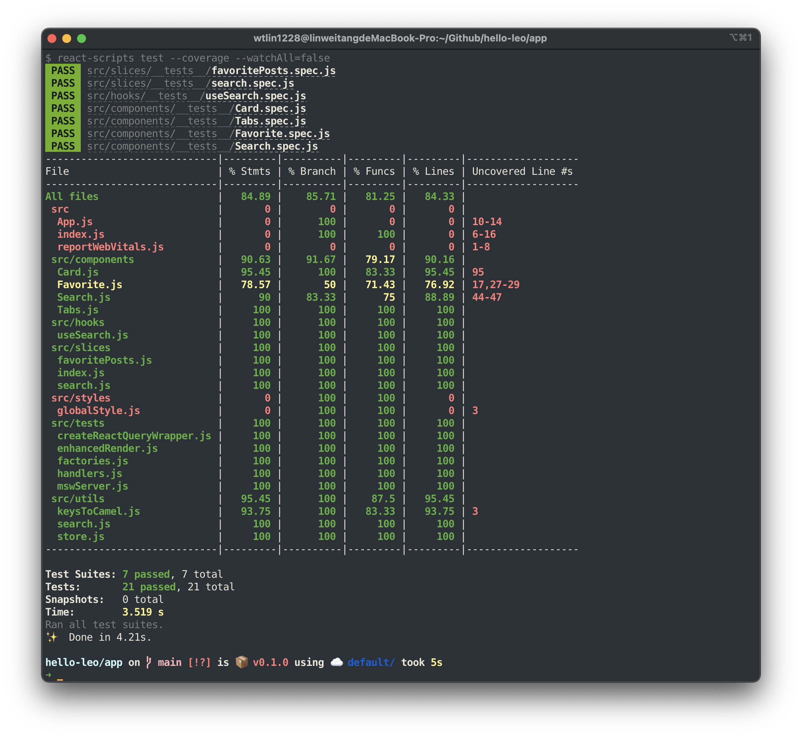
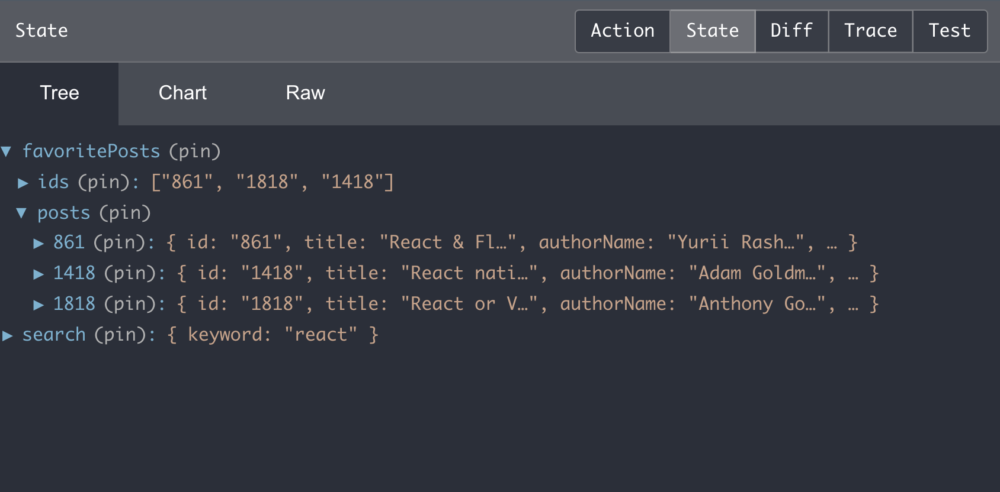

# Review Points

1. Unit Tests
2. Separate Server Side and Client Side State
3. Cache the Query
4. Normalizing State Shape
5. Debounce
6. Redirects

## Unit Tests

### Coverage



### Test Utilities

Test utilities are put in `/app/src/tests`.

```
/app/src/tests
├── createReactQueryWrapper.js (provide react-query wrapper with options for testing only)
├── enhancedRender.js (provide wrapper contains all providers and can accept an option parameter)
├── factories.js (factories for generating mock data)
├── handler.js (can set the default mock endpoint here)
└── mswServer.js
```

### Redux

Tests are put in `/app/src/slices/__tests__`. 

Each reducer declared in slices should be tested including the initial state.

### React Query

Tests are put in `/app/src/hooks/__tests__`.

+ Wrapper - use custom wrapper `createReactQueryWrapper` to disable the automatically [retry](https://react-query.tanstack.com/guides/query-retries#_top).
+ Render - use [@testing-library/react-hooks](https://github.com/testing-library/react-hooks-testing-library) to render custom hooks.
+ Mock API - use [msw](https://mswjs.io/) to mock out the success and fail request.

### Components

Tests are put in `/app/src/components/__tests__`.

+ 3A Pattern - follow the Arrange-Act-Assert pattern to keep test cases small and readable.
+ Render - use custom wrapper `enhancedRender` that extends the original render from `@testing-library/react` to render components.

### Jest

The default setup file created by CRA is put in `/app/src/setupTests.js`.

+ Reset the msw server for each tests
+ Silence the react-query errors because we don't want to see reds during the tests.

## Separate Server Side and Client Side State

Redux is responsible for client side state and React Query is for server side state. Therefore, fetching server data is handled by react-query. And UI data that needs to be passed through different pages/components is handled by redux.

## Cache the Query

The searching request with the same query won't be sent frequently. Because react-query handle the cache time, the response will remain in memory until it's stale. 

In `/app/src/hooks/useSearch.js`, array keys are chosen to provide the unique key. For example, the query key is `['search', 'react']` when the keyword is `react`. Next time user searches `react` again, react-query will check `['search', 'react']` before sending the request.


## Normalizing State Shape

[Normalizing the state shape](https://redux.js.org/recipes/structuring-reducers/normalizing-state-shape) brings us some advantages based on the use cases. Sometimes makes it easier to developing new feature. And sometimes it improves the performance.

In `/app/src/slices/favoritePosts.js`, post are normalized. Instead of `Post[]` shape, it's `Object.<string, Post>` shape. So, if the product team want to add a `Hate` feature. We can implement it easily.




## Debounce

Use RxJS [fromEvent](https://rxjs.dev/api/index/function/fromEvent) to produce a event stream. Then use [debounceTime](https://rxjs.dev/api/operators/debounceTime) to achieve debounce effect.

## Redirects

Need additional configuration because we use `BrowserRouter` instead of `HashRouter`.

Put a `_redirects` file into `/app/build` then run `netlify deploy --prod` after `yarn build`.

```
# Redirects from what the browser requests to what we serve
/* /index.html 200
```

Reference: https://docs.netlify.com/routing/redirects/